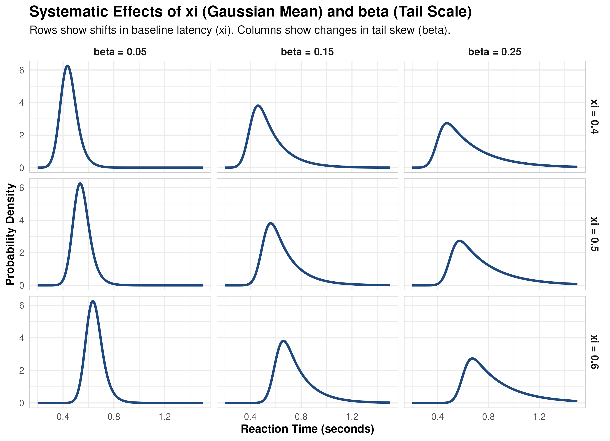
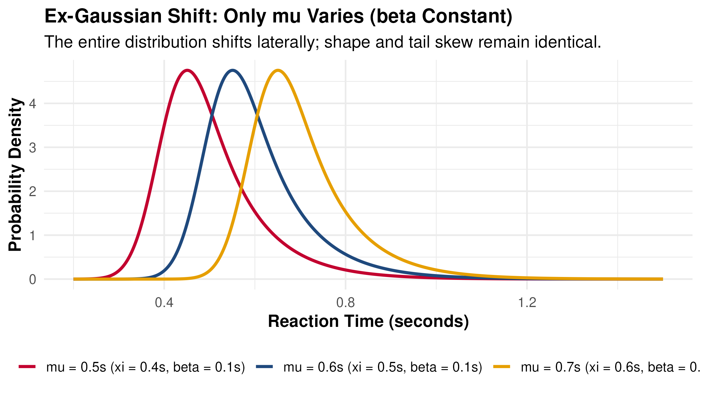
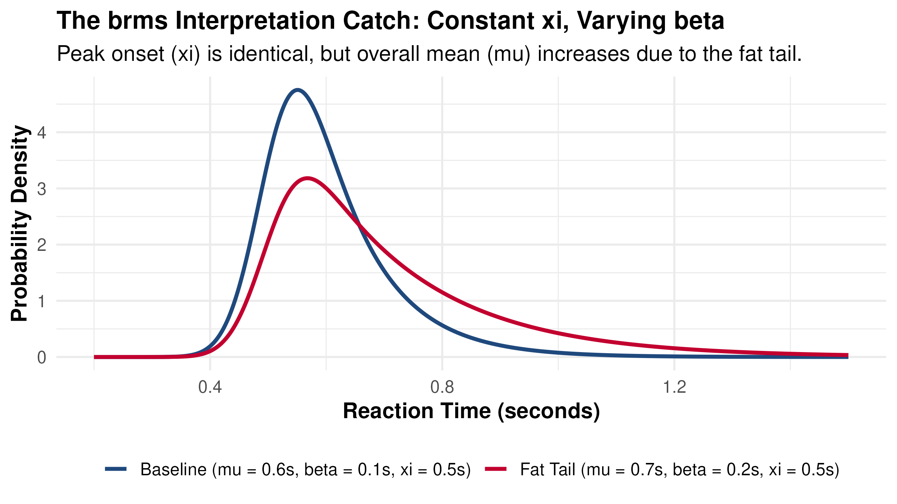

## Workshop plan

Welcome to our workshop on analyzing data from experiments in cognitive psychology, and linguistics, and education using frequentist and Bayesian linear mixed models. 

Here is the plan for this workshop:

- **Session 1 (yesterday)**
  - **Part 1** Introducing the workshop data sets
  - **Part 2:** Data preprocessing, exclusions, and custom contrast coding
  - **Part 3:** Linear mixed-effects modeling of response times (Gaussian) using `lme4`

- **Session 2 (today)**
  - **Part 1** Introduction to Bayesian models
  - **Part 2:** Modeling response times with the Gaussian distribution in `brms`
  - **Part 3:** Using the ex-Gaussian distribution in `brms`
  - **Part 4:** Predicting multiple parameters

## Part 1: Introduction to Bayesian models {.dark-bg background-color="#C2002F"}

## Why Bayesian Multilevel Models?

Yesterday, we have seen that frequentist models (`lme4`) suffer from critical limitations:

1. **Convergence Issues:** Complex maximal random-effect structures often fail to converge or result in zero-variance estimates.
2. **Only work with a handful of distributions:** RTs (and other measures such as eye-tracking fixation durations) are highly skewed. This can be addressed with transformations, but it is not ideal. The Gaussian family cannot model the true shape of the data.
3. **Conceptual issues of frequentist inference:** Confidence intervals and $p$-values are frequently misinterpreted; they do not state the probability of an effect being true.

## Basic introduction to Bayesian Inference

- In frequentist statistics, we set up a "straw man" hypothesis (the null) and compute the probability of observing our data (or more extreme) if the null were true. This is the $p$-value, a probability of the data given a hypothesis (the hypothesis that the parameter specifying the size of our effect is zero). The $p$-value is often misinterpreted as the probability that our hypothesis is true, which it is not.
- Bayesian inference allows us directly estimate the probability of our hypotheses (or, more generally, the parameters of our model) given the data. This is done by combining our prior beliefs (priors) with the likelihood of the observed data to obtain a posterior distribution over our parameters of interest.

## Bayes' Theorem

Bayes' theorem formalizes the process of updating our beliefs about parameters $\theta$ in light of new data $D$:
$$P(\theta | D) = \frac{P(D | \theta) P(\theta)}{P(D)}$$
Where:

- $P(\theta | D)$ is the posterior distribution of the parameters $\theta$ given the data $D$.
- $P(D | \theta)$ is the likelihood of the data given the parameters.
- $P(\theta)$ is the prior distribution of the parameters.
- $P(D)$ is the marginal likelihood of the data, which serves as a normalizing constant.

The new probability distribution $P(\theta | D)$ (the posterior) can become the prior for the next round of data collection, allowing for continuous updating of our beliefs as we gather more evidence.

## Why doesn't everyone use Bayesian models?

- **Computational Complexity:** Frequentist statistics rely on very simple probability distributions and many methods have closed-form solutions. You can literally do an ANOVA with a calculator!  
  - Of course, linear mixed models introduce computational complexity of their own. They are still usually much faster to fit (unless you specify a model with convergence issues!). 
  - Bayesian models, on the other hand, normally require Markov Chain Monte Carlo (MCMC) sampling to approximate the posterior distribution, which can be computationally intensive, especially for complex models or large datasets.
    * However, modern hardware and efficient algorithms (e.g., Hamiltonian Monte Carlo) are perfectly capable of fitting Bayesian models in a reasonable time frame. 
    * Your laptop can probably do it, although you may want to take a break and get a coffee while it runs.

## Why doesn't everyone use Bayesian models? (continued)

- **Steep Learning Curve:** Bayesian statistics require a different way of thinking about probability and inference. It can be challenging for those trained in the frequentist paradigm to understand concepts like priors, posteriors, and credible intervals.
  - **Software and Tools:** Software like `brms` has made Bayesian modeling as easy as fitting an LMM in `lme4`. 
    * There is a danger here, since you do not have to understand the underlying mechanics to fit a Bayesian model that you may then be unable to interpret correctly!

## How does MCMC work?

- **Markov Chain Monte Carlo (MCMC)** allows us to sample from complex, high-dimensional posterior distributions that cannot be solved analytically.
- By sampling the posterior distribution one point at a time, we avoid the need to compute the marginal likelihood $P(D)$, which be very difficult to calculate. Instead, we can approximate the posterior distribution by generating a large number of samples from it.

## Metropolis-Hastings Algorithm

1. **Start:** Place a random walker at an initial state $\theta$.
2. **Propose:** Propose a candidate state $\theta_{\text{proposed}}$ from a symmetric proposal distribution (e.g., Gaussian step size).
3. **Acceptance Ratio:** Compute the probability ratio:
   $$\alpha = \frac{P(\theta_{\text{proposed}} | D)}{P(\theta_{\text{current}} | D)}$$
4. **Decision:**
    - If $\alpha \ge 1$: **Accept** the move.
    - If $\alpha < 1$: **Accept with probability $\alpha$**. Otherwise, **reject** and stay at the current state.

- This works: The samples will be a representative draw from the true posterior distribution. If the proposal distribution is not symmetric, we can adjust the acceptance ratio to account for the asymmetry, but the core idea remains the same.

## Metropolis-Hastings: The Mathematical Trick

MH compares the posterior probability of the proposed state to the current state:

$$\alpha = \frac{P(\theta_{\text{proposed}} | D)}{P(\theta_{\text{current}} | D)}$$

Let's expand that using Bayes' theorem:

$$\alpha = \frac{\frac{P(D | \theta_{\text{proposed}}) P(\theta_{\text{proposed}})}{P(D)}}{\frac{P(D | \theta_{\text{current}}) P(\theta_{\text{current}})}{P(D)}}$$

::: {.accent-box}
Notice what happens to the impossible-to-calculate denominator, $P(D)$: **It completely cancels out!**

$$\alpha = \frac{P(D | \theta_{\text{proposed}}) P(\theta_{\text{proposed}})}{P(D | \theta_{\text{current}}) P(\theta_{\text{current}})}$$
:::

## Simulating MCMC Sampling

```{=html}
<div id="mcmc-card" style="background: #1e1e24; padding: 15px; border-radius: 12px; box-shadow: 0 4px 15px rgba(0,0,0,0.3); color: #e2e8f0; font-family: monospace; display: flex; flex-direction: column; align-items: center; max-width: 780px; margin: 0 auto;">
    <h4 style="margin: 0 0 5px 0; color: #a5b4fc; font-size: 16px;">MCMC Joint, Marginal & Parameter Chain Sampler</h4>
    <p style="margin: 0 0 10px 0; font-size: 11px; color: #a1a1aa; text-align: center;">Concentric rings: target contours. Histograms: empirical margins. Right: trace plot chains.</p>
    
    <canvas id="mcmcCanvas" width="750" height="450" style="border: 1px solid #3f3f46; border-radius: 6px; background: #09090b; display: block;"></canvas>
    
    <div style="margin-top: 10px; display: flex; align-items: center; gap: 8px; font-size: 12px;">
        <label for="speedSlider">Speed:</label>
        <input type="range" id="speedSlider" min="1" max="100" value="35" style="cursor: pointer; width: 180px;">
    </div>

    <div style="margin-top: 10px; display: flex; gap: 10px; font-size: 11px; width: 100%; justify-content: center;">
        <div style="background: #27272a; padding: 6px 10px; border-radius: 6px; border: 1px solid #3f3f46; text-align: center;">Samples: <span id="totalSamples" style="font-weight: bold; color: #a5b4fc;">0</span></div>
        <div style="background: #27272a; padding: 6px 10px; border-radius: 6px; border: 1px solid #3f3f46; text-align: center;">Accept Rate: <span id="accRate" style="font-weight: bold; color: #a5b4fc;">0.0%</span></div>
    </div>
</div>

<script>
(function() {
  const canvas = document.getElementById('mcmcCanvas');
  if (!canvas) return;
  const ctx = canvas.getContext('2d');

  // Layout geometry config
  const PAD_LEFT = 50;
  const PAD_TOP = 100;
  const MAIN_SIZE = 320; 
  const MARGIN_PANEL_SIZE = 90; 

  // Geometry config for chains
  const CHAIN_X_START = 490;
  const CHAIN_WIDTH = 230;
  const CHAIN_HEIGHT = 100;
  const CHAIN_Y1_START = 105; // X parameter chain (mu)
  const CHAIN_Y2_START = 265; // Y parameter chain (beta)

  // Simulation settings
  let currentX = 0.0;
  let currentY = 0.0;
  const proposalSigma = 0.4;

  let samples = [];
  let totalAttempts = 0;
  let totalAccepts = 0;
  let frameCounter = 0;

  const numBins = 50;
  const binsX = new Array(numBins).fill(0);
  const binsY = new Array(numBins).fill(0);

  let proposedX = null;
  let proposedY = null;
  let proposalAccepted = false;

  const speedSlider = document.getElementById('speedSlider');
  const totalSamplesEl = document.getElementById('totalSamples');
  const accRateEl = document.getElementById('accRate');

  function toCanvasX(x) { return PAD_LEFT + (x + 3) * (MAIN_SIZE / 6); }
  function toCanvasY(y) { return PAD_TOP + (3 - y) * (MAIN_SIZE / 6); }

  function targetPDF(x, y) {
      const q = x * x - 1.2 * x * y + y * y;
      return Math.exp(-0.5 * q);
  }

  // Pre-render background space with Heatmap + Contour Lines
  const bgCanvas = document.createElement('canvas');
  bgCanvas.width = MAIN_SIZE;
  bgCanvas.height = MAIN_SIZE;
  const bgCtx = bgCanvas.getContext('2d');

  function preRenderBackground() {
      // 1. Draw smooth underlying density gradient
      const imgData = bgCtx.createImageData(MAIN_SIZE, MAIN_SIZE);
      for (let cx = 0; cx < MAIN_SIZE; cx++) {
          for (let cy = 0; cy < MAIN_SIZE; cy++) {
              const x = (cx / MAIN_SIZE) * 6 - 3;
              const y = 3 - (cy / MAIN_SIZE) * 6;
              const prob = targetPDF(x, y);
              const index = (cx + cy * MAIN_SIZE) * 4;
              
              imgData.data[index] = 31;                         // R (Nebrija Navy base)
              imgData.data[index + 1] = 73;                     // G
              imgData.data[index + 2] = 125 * prob + 30;        // B
              imgData.data[index + 3] = 255 * prob * 0.35;      // Subtle background alpha
          }
      }
      bgCtx.putImageData(imgData, 0, 0);

      // 2. Overlay analytical Contour Rings
      const contourLevels = [0.1, 0.3, 0.5, 0.7, 0.9];
      const scale = MAIN_SIZE / 6; // pixels per mathematical unit
      const centerX = MAIN_SIZE / 2;
      const centerY = MAIN_SIZE / 2;

      bgCtx.lineWidth = 1.5;
      
      contourLevels.forEach(level => {
          const c = -2 * Math.log(level);
          const radiusX = Math.sqrt(c / 0.4) * scale; // Major axis length
          const radiusY = Math.sqrt(c / 1.6) * scale; // Minor axis length
          
          bgCtx.beginPath();
          bgCtx.ellipse(centerX, centerY, radiusX, radiusY, -Math.PI / 4, 0, 2 * Math.PI);
          bgCtx.strokeStyle = `rgba(129, 140, 248, ${0.2 + level * 0.5})`;
          bgCtx.stroke();
      });
  }
  preRenderBackground();

  function randomNormal() {
      let u = 0, v = 0;
      while(u === 0) u = Math.random(); 
      while(v === 0) v = Math.random();
      return Math.sqrt(-2.0 * Math.log(u)) * Math.cos(2.0 * Math.PI * v);
  }

  function stepMCMC() {
      proposedX = currentX + randomNormal() * proposalSigma;
      proposedY = currentY + randomNormal() * proposalSigma;
      
      const pCurrent = targetPDF(currentX, currentY);
      const pProposed = targetPDF(proposedX, proposedY);
      const acceptanceRatio = pProposed / pCurrent;
      
      totalAttempts++;
      
      if (Math.random() < acceptanceRatio) {
          currentX = proposedX;
          currentY = proposedY;
          totalAccepts++;
          proposalAccepted = true;
      } else {
          proposalAccepted = false;
      }
      
      samples.push({x: currentX, y: currentY});

      let idxX = Math.floor((currentX + 3) / 6 * numBins);
      if (idxX >= 0 && idxX < numBins) binsX[idxX]++;
      
      let idxY = Math.floor((currentY + 3) / 6 * numBins);
      if (idxY >= 0 && idxY < numBins) binsY[idxY]++;
  }

  function drawChains() {
      const historyLen = 150;
      const startIdx = Math.max(0, samples.length - historyLen);
      const visibleSamples = samples.slice(startIdx);
      
      // Draw Chain X (Top - mu)
      ctx.strokeStyle = '#3f3f46';
      ctx.lineWidth = 1;
      ctx.strokeRect(CHAIN_X_START, CHAIN_Y1_START, CHAIN_WIDTH, CHAIN_HEIGHT);
      
      // Zero line
      ctx.strokeStyle = 'rgba(255, 255, 255, 0.15)';
      ctx.beginPath();
      ctx.moveTo(CHAIN_X_START, CHAIN_Y1_START + CHAIN_HEIGHT / 2);
      ctx.lineTo(CHAIN_X_START + CHAIN_WIDTH, CHAIN_Y1_START + CHAIN_HEIGHT / 2);
      ctx.stroke();
      
      // Label
      ctx.fillStyle = '#a1a1aa';
      ctx.font = '11px monospace';
      ctx.fillText('Trace X', CHAIN_X_START, CHAIN_Y1_START - 8);
      
      if (visibleSamples.length > 0) {
          ctx.strokeStyle = '#818cf8'; // Indigo
          ctx.lineWidth = 1.2;
          ctx.beginPath();
          for (let i = 0; i < visibleSamples.length; i++) {
              const cx = CHAIN_X_START + (i / (historyLen - 1)) * CHAIN_WIDTH;
              const cy = CHAIN_Y1_START + CHAIN_HEIGHT / 2 - (visibleSamples[i].x * (CHAIN_HEIGHT / 6));
              if (i === 0) ctx.moveTo(cx, cy);
              else ctx.lineTo(cx, cy);
          }
          ctx.stroke();
      }

      // Draw Chain Y (Bottom - beta)
      ctx.strokeStyle = '#3f3f46';
      ctx.lineWidth = 1;
      ctx.strokeRect(CHAIN_X_START, CHAIN_Y2_START, CHAIN_WIDTH, CHAIN_HEIGHT);
      
      // Zero line
      ctx.strokeStyle = 'rgba(255, 255, 255, 0.15)';
      ctx.beginPath();
      ctx.moveTo(CHAIN_X_START, CHAIN_Y2_START + CHAIN_HEIGHT / 2);
      ctx.lineTo(CHAIN_X_START + CHAIN_WIDTH, CHAIN_Y2_START + CHAIN_HEIGHT / 2);
      ctx.stroke();
      
      // Label
      ctx.fillStyle = '#a1a1aa';
      ctx.font = '11px monospace';
      ctx.fillText('Trace Y', CHAIN_X_START, CHAIN_Y2_START - 8);
      
      if (visibleSamples.length > 0) {
          ctx.strokeStyle = '#f472b6'; // Pink
          ctx.lineWidth = 1.2;
          ctx.beginPath();
          for (let i = 0; i < visibleSamples.length; i++) {
              const cx = CHAIN_X_START + (i / (historyLen - 1)) * CHAIN_WIDTH;
              const cy = CHAIN_Y2_START + CHAIN_HEIGHT / 2 - (visibleSamples[i].y * (CHAIN_HEIGHT / 6));
              if (i === 0) ctx.moveTo(cx, cy);
              else ctx.lineTo(cx, cy);
          }
          ctx.stroke();
      }
  }

  function draw() {
      ctx.clearRect(0, 0, canvas.width, canvas.height);
      
      ctx.drawImage(bgCanvas, PAD_LEFT, PAD_TOP);
      
      ctx.strokeStyle = '#3f3f46';
      ctx.lineWidth = 1;
      ctx.strokeRect(PAD_LEFT, PAD_TOP, MAIN_SIZE, MAIN_SIZE);
      
      ctx.fillStyle = 'rgba(165, 180, 252, 0.22)'; 
      for(let i = 0; i < samples.length; i++) {
          ctx.fillRect(toCanvasX(samples[i].x), toCanvasY(samples[i].y), 1.5, 1.5);
      }
      
      if (proposedX !== null) {
          ctx.beginPath();
          const prevX = proposalAccepted ? samples[samples.length-2]?.x || currentX : currentX;
          const prevY = proposalAccepted ? samples[samples.length-2]?.y || currentY : currentY;
          
          ctx.moveTo(toCanvasX(prevX), toCanvasY(prevY));
          ctx.lineTo(toCanvasX(proposedX), toCanvasY(proposedY));
          ctx.lineWidth = 1.8;
          ctx.strokeStyle = proposalAccepted ? '#10b981' : '#ef4444';
          ctx.stroke();
          
          ctx.beginPath();
          ctx.arc(toCanvasX(proposedX), toCanvasY(proposedY), 3.5, 0, 2 * Math.PI);
          ctx.fillStyle = proposalAccepted ? '#10b981' : '#ef4444';
          ctx.fill();
      }
      
      ctx.beginPath();
      ctx.arc(toCanvasX(currentX), toCanvasY(currentY), 5.5, 0, 2 * Math.PI);
      ctx.fillStyle = '#6366f1';
      ctx.strokeStyle = '#ffffff';
      ctx.lineWidth = 1.2;
      ctx.fill();
      ctx.stroke();
      
      // X Histograms (Top Panel)
      const maxBinX = Math.max(...binsX, 1);
      const binW = MAIN_SIZE / numBins;
      ctx.fillStyle = 'rgba(99, 102, 241, 0.35)';
      for (let i = 0; i < numBins; i++) {
          const cx = PAD_LEFT + i * binW;
          const barHeight = (binsX[i] / maxBinX) * (MARGIN_PANEL_SIZE - 10);
          const cy = (PAD_TOP - 15) - barHeight;
          ctx.fillRect(cx, cy, binW - 1, barHeight);
      }
      
      // X Analytical Curve
      ctx.beginPath();
      for (let i = 0; i <= MAIN_SIZE; i++) {
          const cx = PAD_LEFT + i;
          const x = (i / MAIN_SIZE) * 6 - 3;
          const density = Math.exp(-0.32 * x * x);
          const cy = (PAD_TOP - 15) - density * (MARGIN_PANEL_SIZE - 10);
          if (i === 0) ctx.moveTo(cx, cy);
          else ctx.lineTo(cx, cy);
      }
      ctx.strokeStyle = '#6366f1';
      ctx.lineWidth = 2;
      ctx.stroke();

      // Y Histograms (Right Panel)
      const maxBinY = Math.max(...binsY, 1);
      const binH = MAIN_SIZE / numBins;
      ctx.fillStyle = 'rgba(99, 102, 241, 0.35)';
      for (let i = 0; i < numBins; i++) {
          const cy = PAD_TOP + MAIN_SIZE - (i + 1) * binH;
          const barWidth = (binsY[i] / maxBinY) * (MARGIN_PANEL_SIZE - 10);
          const cx = PAD_LEFT + MAIN_SIZE + 15;
          ctx.fillRect(cx, cy, barWidth, binH - 1);
      }
      
      // Y Analytical Curve
      ctx.beginPath();
      for (let i = 0; i <= MAIN_SIZE; i++) {
          const cy = PAD_TOP + i;
          const y = 3 - (i / MAIN_SIZE) * 6;
          const density = Math.exp(-0.32 * y * y);
          const cx = (PAD_LEFT + MAIN_SIZE + 15) + density * (MARGIN_PANEL_SIZE - 10);
          if (i === 0) ctx.moveTo(cx, cy);
          else ctx.lineTo(cx, cy);
      }
      ctx.strokeStyle = '#6366f1';
      ctx.lineWidth = 2;
      ctx.stroke();
      
      // Draw scrolling MCMC parameter chains
      drawChains();
      
      totalSamplesEl.textContent = samples.length;
      const rate = totalAttempts > 0 ? ((totalAccepts / totalAttempts) * 100).toFixed(1) : 0;
      accRateEl.textContent = `${rate}%`;
  }

  let animationId = null;
  function animationLoop() {
      frameCounter++;
      const val = speedSlider ? parseInt(speedSlider.value) : 35;
      
      if (val <= 40) {
          const framesPerStep = 41 - val;
          if (frameCounter % framesPerStep === 0) {
              stepMCMC();
          }
      } else {
          const stepsPerFrame = Math.round((val - 40) * 1.25) + 1;
          for(let i = 0; i < stepsPerFrame; i++) {
              stepMCMC();
          }
      }
      draw();
      animationId = requestAnimationFrame(animationLoop);
  }

  animationLoop();
  
  canvas.addEventListener('remove', function() {
      if (animationId) cancelAnimationFrame(animationId);
  });
})();
</script>
```

## Modern MCMC algorithms 

- Modern MCMC algorithms, such as Hamiltonian Monte Carlo (HMC) and its variant No-U-Turn Sampler (NUTS), are more efficient than the basic Metropolis-Hastings algorithm. They can explore the parameter space more effectively and converge faster.


## Prior Specification

Bayesian inference combines our **Priors** (prior beliefs about parameter scales) and **Likelihood** (observed data) to calculate the **Posterior** distribution.

::: {style="font-size: 65%;"}
We can use the following types of priors:

* **Uninformative priors:** Priors that do not provide any information about the parameters (e.g., uniform distribution). `brms` will use these by default for coefficents if no other prior is specified. These priors sound "objective", but they are actually extremely unrealistic since they consider an effect size of 100000 ms to be equally likely as 10 ms.
    * The sampler may have to explore a very wide parameter space, which can lead to convergence issues and inefficient sampling.
* **Weakly informative/regularizing priors:** These priors are centered on 0, but exclude impossible and improbable values. These priors do not need to be narrow -- even setting the widest range of parameters you would possibly consider helps the sampler avoid getting stuck.
    * For example: From other studies, I think the discordant flanker might slow participants down somewhere between 0 and 50 ms compared to the congruent condition. Since I want to be particularly careful, I set a normal prior with mean 0 and SD 100 ms, which allows for a wide range of plausible effects (even in the opposite direction) but excludes extreme effects such as a differences of 10 s or more. Even with a moderate amount of observations in your data the exact width of the prior usually does not matter since the prior is easily overwhelmed by the observed data.
* **Strongly informative priors**: These have a mean that is different from 0. You could use these if you are very confident about the direction and size of the effect based on previous research. However, these priors can be controversial and should be used with caution, as they can heavily influence the posterior distribution and may lead to biased results if the prior information is incorrect.
:::


## Priors for Coefficients (`class = "b"`)

::: {.columns}
::: {.column width="60%"}
```{r}
#| label: plot-coef-prior
#| echo: false
#| eval: true
#| fig-align: "center"
#| out-width: "100%"
#| fig-height: 4.5
#| message: false
#| warning: false
library(ggplot2)
library(dplyr)

x_seq <- seq(-1, 1, length.out = 500)
df_coef <- bind_rows(
  tibble(x = x_seq, y = 0.5, Prior = "Default: Flat Prior\n(Improper Uniform over [-Inf, +Inf])"),
  tibble(x = x_seq, y = dnorm(x_seq, mean = 0, sd = 0.1), Prior = "Recommended: Normal(0, 0.1)\n(100 ms SD, concentrates near 0)")
)

ggplot(df_coef, aes(x = x, y = y, color = Prior)) +
  geom_line(linewidth = 1.2) +
  facet_wrap(~ Prior, scales = "free_y") +
  scale_color_manual(values = c("#1F497D", "#C2002F")) +
  theme_minimal(base_size = 13, base_family = "sans") +
  theme(
    legend.position = "none",
    strip.text = element_text(face = "bold", size = 11, color = "#1F497D"),
    plot.title = element_text(face = "bold", color = "#1F497D", size = 14)
  ) +
  labs(
    title = "Default vs. Recommended Priors for Coefficients",
    x = "Effect Size (seconds)",
    y = "Prior Probability Density"
  )
```
:::

::: {.column width="40%"}
::: {style="font-size: 65%;"}
**Default Prior:**

* Flat prior allows **absurdly huge values** (e.g. slowing down by 1000s).
* Can cause convergence issues as the sampler wastes time in impossible regions.

**Recommended Prior:**

* **Normal(0, 0.1)** (100 ms SD) on raw RT.
* Restricts effects to plausible scales while being wide enough to let data speak.
* center at 0 represents the conservative null hypothesis (shrinkage).
:::
:::
:::

* Pick a prior that is appropriate for your effect size!


## Priors for Group-Level SDs (`class = "sd"`)

::: {.columns}
::: {.column width="60%"}
```{r}
#| label: plot-sd-prior
#| echo: false
#| eval: true
#| fig-align: "center"
#| out-width: "100%"
#| fig-height: 4.5
#| message: false
#| warning: false
library(ggplot2)
library(dplyr)

x_seq <- seq(0, 4, length.out = 500)
half_t_density <- function(x, df, scale) {
  ifelse(x >= 0, 2 * dt(x / scale, df = df) / scale, 0)
}

df_sd <- bind_rows(
  tibble(x = x_seq, y = half_t_density(x_seq, df = 3, scale = 2.5), Prior = "Default: Half-Student-t(3, 0, 2.5)\n(Heavy-tailed, peaks near 0, very thick tail)"),
  tibble(x = x_seq, y = dexp(x_seq, rate = 2), Prior = "Recommended: Exponential(2)\n(Peak at 0, drops off quickly to prevent singular fits)")
)

ggplot(df_sd, aes(x = x, y = y, color = Prior)) +
  geom_line(linewidth = 1.2) +
  facet_wrap(~ Prior, scales = "free_y") +
  scale_color_manual(values = c("#1F497D", "#C2002F")) +
  theme_minimal(base_size = 13, base_family = "sans") +
  theme(
    legend.position = "none",
    strip.text = element_text(face = "bold", size = 11, color = "#1F497D"),
    plot.title = element_text(face = "bold", color = "#1F497D", size = 14)
  ) +
  labs(
    title = "Default vs. Recommended Priors for Group SDs",
    x = "Standard Deviation (seconds)",
    y = "Prior Probability Density"
  )
```
:::

::: {.column width="40%"}
::: {style="font-size: 60%;"}
**Default Prior:**

* **Half-Student-t(3, 0, 2.5)**.
* Heavy tail accommodates very large standard deviations easily.
* Less regularizing if data is sparse or structure is complex.

**Recommended Prior:**

* **Exponential(2)** (mean = 0.5s).
* Mode at 0 provides **shrinkage** toward 0 unless supported by data.
* **Prevents singular fits** and stabilizes sampling.
* *Scaling Note:* Exponential priors **must be scaled** to your DV's measurement scale! `exponential(2)` (mean = 0.5s) works for RT in seconds. For milliseconds, scale the rate accordingly (e.g. `exponential(0.002)` for a 500 ms mean).

:::
:::
:::

::: {.accent-box}
**Rule of Thumb:** When in doubt, use the default priors, **except** for fixed effect coefficients (where you should always specify a regularizing prior like `normal`).
:::

## Priors for Group Correlations (`class = "cor"`)

::: {.columns}
::: {.column width="60%"}
```{r}
#| label: plot-cor-prior
#| echo: false
#| eval: true
#| fig-align: "center"
#| out-width: "100%"
#| fig-height: 4.5
#| message: false
#| warning: false
library(ggplot2)
library(dplyr)

x_seq <- seq(-1, 1, length.out = 500)
df_cor <- bind_rows(
  tibble(x = x_seq, y = 0.5, Prior = "Default: LKJ(1)\n(Uniform over [-1, 1], all correlations equally likely)"),
  tibble(x = x_seq, y = 0.75 * (1 - x_seq^2), Prior = "Recommended: LKJ(2)\n(Parabolic shape, penalizes extreme correlations)")
)

ggplot(df_cor, aes(x = x, y = y, color = Prior)) +
  geom_line(linewidth = 1.2) +
  facet_wrap(~ Prior, scales = "free_y") +
  scale_color_manual(values = c("#1F497D", "#C2002F")) +
  theme_minimal(base_size = 13, base_family = "sans") +
  theme(
    legend.position = "none",
    strip.text = element_text(face = "bold", size = 11, color = "#1F497D"),
    plot.title = element_text(face = "bold", color = "#1F497D", size = 14)
  ) +
  labs(
    title = "Default vs. Recommended LKJ Priors for Correlations",
    x = "Correlation (r)",
    y = "Prior Probability Density"
  )
```
:::

::: {.column width="40%"}
::: {style="font-size: 65%;"}
**Default Prior:**

* **LKJ(1)** prior.
* Completely uniform over correlation matrices.
* Highly extreme correlation values like $\pm 0.99$ are just as likely as 0.

**Recommended Prior:**

* **LKJ(2)** prior (or larger, e.g., LKJ(4)).
* Parabolic density shape centered at 0.
* **Shrinks correlation estimates toward zero**, preventing over-fitting and stabilizing random slope-intercept covariance structures.
:::
:::
:::


## Modeling response times with the Gaussian distribution {.dark-bg background-color="#C2002F"}

## Fit the model with `brms`

To transition from Frequentist LMMs (`lme4`) to Bayesian LMMs (`brms`), we can fit an identical formula structure using a Gaussian family. 

```{r}
#| eval: false
#| echo: true
library(brms)
library(here)

# Same formula and contrasts as lme4 model
fit_gaussian <- brm(
  formula = rt ~ Condition * StimulusType + 
    (Condition * StimulusType | subject) + 
    (Condition | item),
  data = flanker_sub,
  family = gaussian(),
  prior = priors_gaussian,
  sample_prior = "yes", # this is important if you want to get Bayes factors later
  chains = 4, iter = 2000, warmup = 1000,
  cores = 4, backend = "cmdstanr",
  # if you have enough processor cores, you can speed up the model by using 2 or more cores per chain
  # this has diminishing returns -- 2 cores won't be twice as fast as one
  threads = threading(2)
)
```

::: {.accent-box}
Unlike `lme4`, `brms` will compute the full joint posterior distribution using MCMC (Hamiltonian Monte Carlo / NUTS) instead of estimating a single point (Maximum Likelihood).
:::

## What do we need to fit a model with brms?

- **Model Formula:** Same as `lme4`, but we can also specify more complex structures.
- **Data:** Same as `lme4`. A data frame with all the variables used in the formula.
- **Priors:** We need to specify prior distributions for all our parameters. This is necessary in Bayesian statistics. `brms` has default priors that it uses if no prior is specified. 

## Specifying Priors

Before running the model, we define regularizing priors to restrict parameters to physiologically plausible bounds and prevent singular fits:

```{r}
#| eval: false
#| echo: true
priors_gaussian <- c(
  # you should set a prior for fixed effects
  prior(normal(0, 0.1), class = "b"), # this is our N(0,1) prior (100 ms SD)          
  # these are optional, the brms priors usually work well
  prior(exponential(2), class = "sd"),          # group-level SD variation
  prior(lkj(2), class = "cor")                  # correlation matrix prior
)
```

::: {.accent-box}
When in doubt, use the default priors, **except** for fixed effect coefficients (where you should always specify a regularizing prior like `normal(0, 0.1)`).
:::

## Model Output: Summary

```{r}
#| label: load-gaussian-model
#| echo: false
#| eval: true
#| message: false
#| warning: false
library(qs2)
library(here)
library(brms)

# Load the pre-fit model (here package deals with path)
fit_gaussian <- qs_read(here("presentations", "fit_gaussian.qs2"))
```

```{r}
summary(fit_gaussian)
```

## Interpretation of the Gaussian LMM Output

::: {style="font-size: 65%;"}
```{r}
#| label: interpret-gaussian-output
#| echo: false
#| eval: true

fixed_effects <- summary(fit_gaussian)$fixed[, c("Estimate", "Est.Error", "l-95% CI", "u-95% CI")]
knitr::kable(round(fixed_effects, 3), format = "markdown")
```

:::

* The **Intercept** (baseline RT) is estimated at `r round(summary(fit_gaussian)$fixed["Intercept", "Estimate"], 2)`s.
* Results are largely similar to the `lme4` model, but now we have **credible intervals** instead of confidence intervals. 

## Interpreting Posterior Distributions

Unlike frequentist point estimates, Bayesian inference gives us a **full probability distribution** (the posterior) for each parameter. We can interpret this distribution in several intuitive ways:

::: {style="font-size: 70%;"}
* **1. Credible Intervals (CI):**
  * Defines the range in which the true parameter value lies with a specific probability (e.g., 95%), given the data and priors.
  * If the interval excludes 0, we have strong evidence of an effect.
* **2. Probability of Direction ($pd$):**
  * The proportion of the posterior distribution that lies on one side of 0 (has the same sign as the mean).
  * Represents the direct probability that an effect is positive or negative.
* **3. Bayes Factors (BF):**
  * Quantifies the relative evidence that the data provides for the alternative hypothesis ($H_1$) vs. the null hypothesis ($H_0$).
:::


## 1. Interpreting Credible Intervals: AGR/CON vs. DIS

To test if the discordant flanker condition (`DIS`) slows down reaction times compared to the average of congruent and control conditions (`CON` and `AGR`), we check the posterior credible interval for:
$$\beta_{\text{CON_AGR_vs_DIS}} = \frac{\text{CON} + \text{AGR}}{2} - \text{DIS}$$

::: {.accent-box}
### Extracting Credible Intervals in R
```{r}
#| echo: true
#| eval: true
# Extract the coefficient summary from fit_gaussian
coef_summary <- summary(fit_gaussian)$fixed["ConditionCON_AGR_vs_DIS", ]
print(round(coef_summary[c("Estimate", "Est.Error", "l-95% CI", "u-95% CI")], 4))
```
:::

::: {style="font-size: 65%;"}
* **Key Interpretation:**
  * The 95% Credible Interval ranges from **`r round(coef_summary["l-95% CI"] * 1000, 1)` ms** to **`r round(coef_summary["u-95% CI"] * 1000, 1)` ms**.
  * Since the interval **does not contain 0**, we have strong evidence that the effect exists.
  * There is a **95% probability** that the true difference is between `r round(coef_summary["l-95% CI"] * 1000, 1)` ms and `r round(coef_summary["u-95% CI"] * 1000, 1)` ms (conditioned on our data and priors).
:::


## 2. Probability of Direction ($pd$): AGR/CON vs. DIS

Rather than a binary "significant / not significant" decision, we can calculate the exact probability that the interference effect is negative (i.e., that `DIS` is slower than `AGR/CON`).

### Calculating $pd$ from MCMC Draws in R
```{r}
#| echo: true
#| eval: true
# Extract the raw MCMC draws for the contrast
draws <- as.data.frame(fit_gaussian)[["b_ConditionCON_AGR_vs_DIS"]]

# Calculate the proportion of draws below 0
pd <- mean(draws < 0)
print(paste("Probability of Direction (pd):", round(pd * 100, 3), "%"))
```


::: {style="font-size: 65%;"}
* **Key Interpretation:**
  * There is a **`r round(pd * 100, 2)`% probability** that discordant flankers slow down response times compared to congruent/control flankers.
  * This direct probability statement is highly intuitive and directly answers the scientific question, avoiding the common misinterpretations of frequentist $p$-values.
  * If the effect were weaker and closer to 0, $pd$ would naturally decrease, representing a graded measure of evidence rather than a rigid threshold.
:::


## 3. Interpreting Bayes Factors: AGR/CON vs. DIS

The Bayes Factor ($BF_{10}$) compares the relative evidence for the alternative hypothesis ($H_1$: $\beta \neq 0$) versus the null hypothesis ($H_0$: $\beta = 0$). In `brms`, the standard way to compute Savage-Dickey Bayes Factors is using the `hypothesis()` command.


### Testing the Contrast Hypothesis in R
```{r}
#| echo: true
#| eval: true
# Run Savage-Dickey hypothesis test on the contrast
hyp <- hypothesis(fit_gaussian, "ConditionCON_AGR_vs_DIS = 0")
print(hyp)
```


::: {style="font-size: 65%;"}
* **Understanding `Evid.Ratio` (Bayes Factor):**
  * The **`Evid.Ratio`** column shows the Savage-Dickey Bayes Factor.
  * Note that this **only works** if you add `sample_prior = "yes"` to the `brm()` command when fitting the model!
  * The result will be **`NA`** if the model was fit without saving prior samples.
  * **Interpreting BF scales (Lee & Wagenmakers, 2013):**
    * $1 - 3$: Anecdotal | $3 - 10$: Moderate | $10 - 30$: Strong | $> 100$: Extreme evidence
:::

## Interpreting MCMC Diagnostics

A critical step in Bayesian workflow is verifying that the chains have successfully converged and explored the target distribution.

::: {style="font-size: 65%;"}
```{r}
#| label: print-gaussian-diagnostics
#| echo: false
#| eval: true
#| message: false
#| warning: false
# Extract convergence diagnostics for population-level parameters
diagnostics <- summary(fit_gaussian)$fixed[, c("Rhat", "Bulk_ESS", "Tail_ESS")]
knitr::kable(round(diagnostics, 2), format = "markdown")
```
:::

* **$\hat{R}$ (Potential Scale Reduction Factor):** Measures variance between vs. within chains. At convergence, $\hat{R} \le 1.01$. Here, all $\hat{R}$ are exactly $1.00$ or $1.01$.
* **ESS (Effective Sample Size):** Number of independent draws. Both **Bulk ESS** (for mean/medians) and **Tail ESS** (for credible intervals) should be $> 400$ (ideally $> 1000$).


## Convergence Issues: Divergences & Treedepth

In addition to $\hat{R}$ and ESS, we must check for Hamiltonian Monte Carlo-specific diagnostics that indicate numerical sampling instabilities:

::: {style="font-size: 65%;"}
### 1. Divergent Transitions ("Divergences")
* **What it means:** The No-U-Turn Sampler's numerical simulation broke down because it hit a region of extremely high curvature (often a hierarchical "funnel" where a group SD is very close to 0).
* **The danger:** The posterior estimates are **invalid and biased**. The sampler cannot explore the "funnel" and misses parts of the distribution.
* **How to fix:**
  * **Increase `adapt_delta`:** E.g., `control = list(adapt_delta = 0.95)` or `0.99`. This forces the sampler to take smaller, more precise steps.
  * **Stronger regularizing priors:** Prevent Stan from drifting into extremely flat or highly curved, unstable areas.

### 2. Maximum Treedepth Warnings
* **What it means:** The sampler took too many steps (default maximum is $2^{10} = 1024$ steps) trying to build a trajectory before turning around. It was terminated early to prevent getting stuck in infinite loops.
* **The danger:** It is **not mathematically invalid** (unlike divergences), but it indicates extreme inefficiency, very slow sampling times, and low ESS.
* **How to fix:**
  * **Increase `max_treedepth`:** E.g., `control = list(max_treedepth = 15)`.
  * **Simplify random effects or improve priors:** High treedepth often indicates collinearity, overparameterization, or unidentifiable parameters.
:::


## Posterior Predictive Check (PPC)

To evaluate how well our model's Gaussian assumption matches the actual response time distribution, we can perform a **Posterior Predictive Check**:

```{r}
#| label: ppc-gaussian-model
#| echo: true
#| eval: true
#| fig-align: "center"
#| out-width: "70%"
#| message: false
#| warning: false
library(bayesplot)
library(ggplot2)
color_scheme_set("red")
pp_check(fit_gaussian, ndraws = 50) +
  theme_minimal(base_family = "sans") +
  labs(
    title = "Posterior Predictive Check (Gaussian brms LMM)",
    x = "Reaction Time (s)",
    y = "Density"
  ) +
  theme(
    plot.title = element_text(face = "bold", color = "#1F497D", size = 14),
    legend.position = "bottom"
  )
```
::: {.accent-box}
Notice that because reaction times are right-skewed, the Gaussian model's replicates (thin lines) fail to capture the long right-tail of the raw data, and instead fits a much wider Gaussian distribution. We should try the **ex-Gaussian**.
:::

## Part 3: Modeling RTs with the ex-Gaussian Distribution {.dark-bg background-color="#C2002F"}

## What is the ex-Gaussian Distribution?

Human reaction times are rarely symmetrical. They are heavily right-skewed. The **ex-Gaussian** distribution represents this shape by combining a Gaussian (normal) component and an exponential component:

$$\text{RT} \sim \text{Normal}(\text{Gaussian}) + \text{Exponential}$$

The distribution is characterized by three parameters:
* **$\xi$ (Gaussian Mean):** Center of the normal component (reflects core decision onset and baseline foveal/cognitive latency).
* **$\sigma$ (Gaussian SD):** Standard deviation of the normal component (reflects foveal processing variance).
* **$\beta$ (or $\tau$, Exponential Scale):** Scale/mean of the exponential component (reflects the slow decision tail, often linked to lapses of attention or threshold leakage).

$$\text{Overall Mean } (M) = \xi + \beta$$

## Systematic Effects of $\xi$ and $\beta$

To understand how the Gaussian center ($\xi$) and the exponential tail ($\beta$) independently shape the density curve, we can systematically vary them across a grid:

{fig-align="center" width="100%"}

## Standard vs. `brms` Parameterization

In most descriptions of the ex-Gaussian distribution, it is parameterized using $(\xi, \sigma, \beta)$ to represent the independent Gaussian and exponential components.

However, `brms` does it differently:

* **In `brms`:** You model **$\mu$ (the overall mean of the entire distribution)** and **$\beta$ (the scale of the exponential component)** directly.
* The central Gaussian mean ($\xi$) is calculated implicitly behind the scenes as:

$$\xi = \mu - \beta$$


## How to interpret this

When **only `mu` varies** in `brms` (while the exponential tail scale `beta` remains constant):

{fig-align="center" width="75%"}

Since $\beta$ is constant and $\mu$ increases, the Gaussian center also increases ($\xi = \mu - \beta$). The entire distribution shifts laterally; the shape and right-tail skew remain identical.

- By default, `brms` will assume that $\beta$ and $\sigma$ are the same for every observation and only $\mu$ is influenced by fixed and random effects.


## Bayesian RT: Priors & ex-Gaussian setup

We will define regularizing priors for both the Gaussian core ($\mu$) and the exponential tail ($\beta$) of our reaction times before fitting the model in `brms`:

```{r}
#| eval: false
library(brms)
library(tidyverse)

# Define regularizing priors on the log/raw scale
priors_exg <- c(
  prior(normal(0, 0.1), class = "b"),                 # Fixed effects on RT
  prior(exponential(2), class = "sd"),                # Subject/Item variation
  prior(lkj(2), class = "cor"),                       # Random correlation matrix
  
  # Priors for the exponential parameter beta
  prior(normal(0, 0.3), class = "b", dpar = "beta")
)
```

## Fitting ex-Gaussian in brms (Command)

```{r}
#| eval: false
# Fit ex-Gaussian model on Flanker Exp 1 correct RTs
blmm_rt <- brm(
  formula = bf(
    rt ~ Condition * StimulusType + (Condition * StimulusType | subject) + (Condition | item),
    beta ~ Condition * StimulusType + (Condition * StimulusType | subject) + (Condition | item)
  ),
  data = flanker_rt_data,
  family = exgaussian(),
  prior = priors_exg,
  chains = 4, iter = 4000, warmup = 2000,
  # if you get divergent transitions, try adapt_delta = 0.95 
  control = list(adapt_delta = 0.8),
  cores = 4, backend = "cmdstanr"
)
```

## Model Output: ex-Gaussian (mu-only)

::: {style="font-size: 55%;"}
```{r}
#| label: load-exg-mu-model
#| echo: false
#| eval: true
#| message: false
#| warning: false
library(qs2)
library(here)
library(brms)

mu_file <- here("presentations", "fit_exgaussian_mu.qs2")
if (file.exists(mu_file)) {
  fit_exg_mu <- qs_read(mu_file)
  fixed_effects_exg_mu <- summary(fit_exg_mu)$fixed
  knitr::kable(round(fixed_effects_exg_mu, 3), format = "markdown")
} else {
  cat("**[Note: Please run 'Rscript presentations/fit_gaussian_brms.R' to generate this table]**")
}
```
:::

::: {.accent-box}
* **$\beta$ (Exponential Scale):** A single value is estimated for $\beta$ across all conditions, representing the average scale of the exponential tail. In this model, $\beta$ is approximately 0.1s (100 ms), indicating that on average, the exponential tail adds about 100 ms of latency to the core Gaussian component. 
`r if (file.exists(here("presentations", "fit_exgaussian_mu.qs2"))) {
  fit_exg_mu <- qs_read(here("presentations", "fit_exgaussian_mu.qs2"))
  paste0(round(summary(fit_exg_mu)$spec_pars["beta", "Estimate"], 3), "s (approx. ", round(summary(fit_exg_mu)$spec_pars["beta", "Estimate"] * 1000), " of latency added by the exponential tail)")
} else {
  "TBD (run model fitting script first)"
}`
:::

## PPC: ex-Gaussian (mu-only) Model

To evaluate the fit of the ex-Gaussian model with fixed/random effects restricted to the mean $\mu$:

```{r}
#| label: ppc-exg-mu-model
#| echo: false
#| eval: true
#| fig-align: "center"
#| out-width: "70%"
#| message: false
#| warning: false
library(bayesplot)
library(ggplot2)
mu_file <- here("presentations", "fit_exgaussian_mu.qs2")
if (file.exists(mu_file)) {
  fit_exg_mu <- qs_read(mu_file)
  color_scheme_set("red")
  p <- pp_check(fit_exg_mu, ndraws = 50) +
    theme_minimal(base_family = "sans") +
    labs(
      title = "Posterior Predictive Check (ex-Gaussian - mu only)",
      x = "Reaction Time (s)",
      y = "Density"
    ) +
    theme(
      plot.title = element_text(face = "bold", color = "#1F497D", size = 14),
      legend.position = "bottom"
    )
  print(p)
} else {
  ggplot() + 
    annotate("text", x = 0.5, y = 0.5, label = "Please run the model fitting script\n(presentations/fit_gaussian_brms.R)\nto view the PPC plot.", size = 5, color = "#C2002F") + 
    theme_void()
}
```

::: {.accent-box}
Notice how much better the ex-Gaussian family captures the raw data's right-skewed tail compared to the standard Gaussian model!
:::

## Part 4: Predicting multiple parameters {.dark-bg background-color="#C2002F"}

## Extending the model: allowing effects on $\beta$

- In `brms`, you can specify a regression equation for every distribution parameter!
- Because of the parameterization used in `brms`, be careful how you interpret the results:

::: {.accent-box}
If your experimental condition only increases the exponential tail ($\beta$) while the core Gaussian component ($\xi$) remains completely unchanged, `brms` will show a positive coefficient for **both** `mu` and `beta` because:
$$\mu = \xi + \beta$$
:::

## Varying beta

When the core Gaussian component **`xi` remains completely constant**, but the **tail skew `beta` increases**:

{fig-align="center" width="75%"}

The peak/onset remains at the exact same location, but the right tail becomes fatter. In `brms`, because $\mu = \xi + \beta$, the overall mean $\mu$ increases, resulting in positive coefficients for **both** `mu` and `beta`!


## Model Output: ex-Gaussian (mu & beta)

Here are the coefficients for both $\mu$ (mean) and $\beta$ (exponential tail scale) from the full model:

::: {style="font-size: 50%;"}
```{r}
#| label: load-exg-mu-beta-model
#| echo: false
#| eval: true
#| message: false
#| warning: false
library(qs2)
library(here)
library(brms)

mu_beta_file <- here("presentations", "fit_exgaussian_mu_beta.qs2")
if (file.exists(mu_beta_file)) {
  fit_exg_mu_beta <- qs_read(mu_beta_file)
  fixed_effects_exg_mu_beta <- summary(fit_exg_mu_beta)$fixed
  knitr::kable(round(fixed_effects_exg_mu_beta, 3), format = "markdown")
} else {
  cat("**[Note: Please run 'Rscript presentations/fit_gaussian_brms.R' to generate this table]**")
}
```
:::

::: {.accent-box}
* Predicting both $\mu$ and $\beta$ reveals whether experimental factors independently influence baseline cognitive latency ($\mu$) vs. processing lapses/decision threshold leakage ($\beta$).
:::

## PPC: ex-Gaussian (mu & beta) Model

To evaluate the full predictive accuracy of the ex-Gaussian model predicting both $\mu$ and $\beta$:

```{r}
#| label: ppc-exg-mu-beta-model
#| echo: false
#| eval: true
#| fig-align: "center"
#| out-width: "70%"
#| message: false
#| warning: false
library(bayesplot)
library(ggplot2)
mu_beta_file <- here("presentations", "fit_exgaussian_mu_beta.qs2")
if (file.exists(mu_beta_file)) {
  fit_exg_mu_beta <- qs_read(mu_beta_file)
  color_scheme_set("red")
  p <- pp_check(fit_exg_mu_beta, ndraws = 50) +
    theme_minimal(base_family = "sans") +
    labs(
      title = "Posterior Predictive Check (ex-Gaussian - mu & beta)",
      x = "Reaction Time (s)",
      y = "Density"
    ) +
    theme(
      plot.title = element_text(face = "bold", color = "#1F497D", size = 14),
      legend.position = "bottom"
    )
  print(p)
} else {
  ggplot() + 
    annotate("text", x = 0.5, y = 0.5, label = "Please run the model fitting script\n(presentations/fit_gaussian_brms.R)\nto view the PPC plot.", size = 5, color = "#C2002F") + 
    theme_void()
}
```

::: {.accent-box}
The fit is almost perfect! By allowing both $\mu$ and $\beta$ to vary, the model can flexibly capture changes in both the core Gaussian latency and the exponential tail, resulting in an excellent match to the raw RT distribution. Also, now we gain insight into where in the distribution our experimental effects are occurring (core latency vs. tail skew).
:::

## Session 2 Summary

::: {style="font-size: 70%;"}
1. We have seen how you can use `brms` to fit Bayesian linear mixed models with the same formula syntax as `lme4`, but with the added flexibility of specifying priors and modeling different likelihood families (e.g. ex-Gaussian for RTs).
2. **Posterior Interpretation:** We interpret Bayesian model outputs using three complementary metrics:
   * **Credible Intervals (CI):** Direct probability (e.g. 95%) that the true effect lies in a given range.
   * **Probability of Direction ($pd$):** Graded direct probability that an effect is positive or negative.
   * **Bayes Factors (BF):** Relative evidence for alternative vs. null ($H_1$ vs. $H_0$), computed in `brms` using `hypothesis(..., sample_prior="yes")`.
3. **HMC Convergence Diagnostics:** When using `brms` and Stan, you must verify that chains have converged by ensuring $\hat{R} \le 1.01$ and ESS $> 1000$. Your model must not have any **divergent transitions** (try increasing `adapt_delta`). If you get warnings about exceeding **maximum treedepth limits**, your model may be very inefficient and require simplification or stronger priors.
4. **Model Verification:** Always perform Posterior Predictive Checks (`pp_check()`) to visually confirm that the model's posterior predictions accurately recreate the shape of the observed data.
:::

## Homework

Try to apply the concepts from this session to your own data! Fit a Bayesian linear mixed model using `brms` with appropriate priors, check convergence diagnostics, and perform posterior predictive checks to evaluate model fit. Write a results section interpreting the credible intervals, probability of direction, and Bayes factors for your key contrasts. See @serrano-carot2026lcn for an example of how to write up Bayesian results.

## References

::: {#refs}
:::

